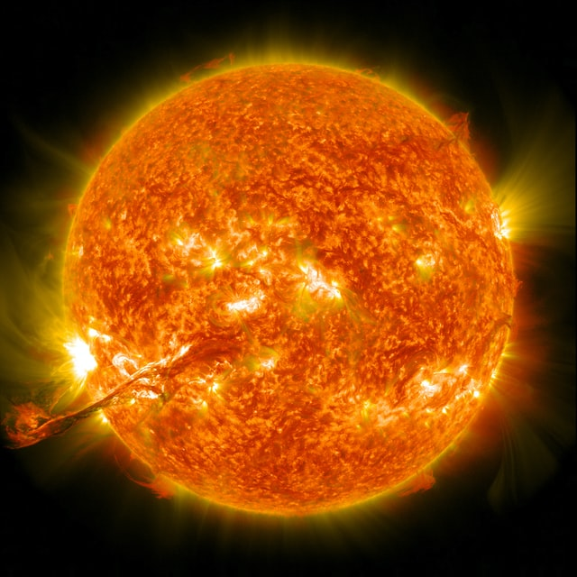

# Time Series Analysis for Number of Sunspots in R (School Project)

The final submitted pdf file can be found [here](https://github.com/sheldonkappel/sunspots_time_series_analysis/blob/main/STAT%205550%20Final%20Project.pdf).

The R code used to perform the analysis was collated into this [this Rmd file](https://github.com/sheldonkappel/sunspots_time_series_analysis/blob/main/STAT_5550_Project.Rmd).

## Concepts Involved
* EDA (Exploratory Data Analysis)
* ARIMA (Autoregressive Integrated Moving Average) and SARIMA (Seasonal Autoregressive Integrated Moving Average) modeling
* ARMA (Autoregressive-moving-average) modeling techniques
* Forecasting and estimation
